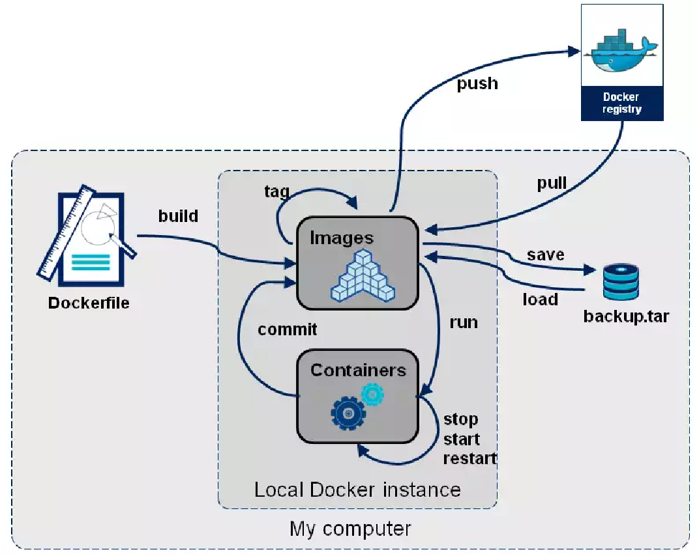

### 05 DockerFile

Un **Dockerfile** es un archivo de texto que contiene instrucciones para construir una imagen de Docker. Define el entorno, las dependencias, y los comandos necesarios para crear un contenedor reproducible y portátil.

Hay dos mecanismos fundamentales para crear imágenes Docker propias:

1. Crear una imagen a partir de un contenedor Docker existente (y ya configurado con los ficheros requeridos) empleando el comando `docker commit`.

2. Crear una imagen a partir de un Dockerfile que describe sus características mediante el comando `docker build`.

### Creación de Imágenes con Dockerfile

Un **Dockerfile** es un fichero de texto donde se indican los parámetros de una imagen Docker y los comandos a ejecutar sobre una imagen base para crear una nueva imagen.

#### Comando `docker build`
- El comando `docker build` construye una nueva imagen (de nombre `-t <nombre>`) siguiendo las instrucciones definidas en el Dockerfile.
- Este comando recibe como parámetro el directorio donde se encuentra el Dockerfile, junto con otros ficheros o directorios que puedan ser necesarios para la creación de la nueva imagen.  
  - Mediante las opciones `COPY` y `ADD`, estos ficheros pueden incorporarse a la nueva imagen.

#### Ejecución del Dockerfile
- `docker build` ejecuta las instrucciones del Dockerfile una a una.  
- Cada instrucción ejecutada crea una **imagen intermedia** (que normalmente se descarta) y aporta una nueva **capa** (layer) a la imagen Docker resultante.

#### Resultado
- La imagen resultante estará disponible en el **repositorio local de imágenes Docker**.

#### Guardar e Importar Imágenes
- Con el comando `docker save <imagen>` se puede volcar una imagen a un fichero `.tar`.  
- Posteriormente, este archivo `.tar` puede ser reimportado con `docker load`.

#### Publicar Imágenes en Docker Hub
1. Es necesario tener una cuenta de usuario en **Docker Hub** y loguearse con `docker login`.
2. Dar un nombre a la imagen con `docker tag`.
3. Subir la imagen a Docker Hub con `docker push`.

Hasta este punto deberíamos ser capaces de comprender y reflexionar sobre el siguiente flujo de vida de las imagenes y contenedores docker.



#### Formato de los Ficheros Dockerfile

1. **FROM**: Define la imagen base sobre la que se construirá la nueva imagen.  
   - **Sintaxis**:  
     `FROM <imagen>`  
     `FROM <imagen>:<tag>`

2. **LABEL**: Permite vincular metadatos (autor, descripción, fecha, etc.) a la imagen.  
   - **Sintaxis**:  
     `LABEL <campo> <valor>`  
     `LABEL <campo>=<valor>`

3. **ENV**: Define variables de entorno disponibles en el contenedor, tanto durante la creación de la imagen como durante su ejecución.  
   - **Sintaxis**:  
     `ENV <variable> <valor>`  
     `ENV <variable>=<valor>`

4. **WORKDIR**: Establece el directorio donde se ejecutarán los comandos indicados con `RUN`, `CMD` o `ENTRYPOINT`.  
   - **Sintaxis**:  
     `WORKDIR <ruta>`

5. **ADD**/**COPY**: Permite agregar o copiar archivos desde el equipo local a la imagen.  
   - **Sintaxis**:  
     `ADD <origen/es>... <destino>`  
     `ADD ["<origen/es>",... "<destino>"]`

6. **EXPOSE**: Declara los puertos TCP/IP en los que el contenedor estará escuchando. Es declarativo y la redirección de puertos debe configurarse manualmente al iniciar el contenedor.  
   - **Sintaxis**:  
     `EXPOSE <puerto/s>`

7. **VOLUME**: Establece los volúmenes que se montarán al ejecutar el contenedor.  
   - **Sintaxis**:  
     `VOLUME <volumen/es>`

8. **RUN**: Permite ejecutar comandos en la imagen base antes de ser creada. Puede haber múltiples comandos `RUN`.  
   - **Sintaxis**:  
     - Formato shell: `RUN <ejecutable con parámetros>`  
     - Formato exec: `RUN ["<ejecutable>", "<parámetro1>", "<parámetro2>"]`

9. **ENTRYPOINT**: Define el "punto de entrada", es decir, el comando que ejecutará el contenedor al iniciarse.  
   - **Nota**: Solo se permite un `ENTRYPOINT` en cada Dockerfile.  
   - **Sintaxis**: Igual que `RUN`.

10. **CMD**: Define el comando que se ejecutará por defecto al iniciar el contenedor, salvo que se especifique otro con `docker run`.  
    - **Nota**: Solo se permite un `CMD` en cada Dockerfile.  
    - Si hay un `ENTRYPOINT` definido, `CMD` actúa como parámetros para el comando del `ENTRYPOINT`.  
    - **Sintaxis**: Igual que `RUN`.

##### Creamos el index.html

```docker
echo HOLA DESDE EL CONTENEDOR-version1 > index.html
``` 
Creamos un `index.html` con el contenido que se muestre por pantalla.

##### Creamos el DockerFile a ejecutar para nuestro servicio Apache

```DockerFile
FROM debian:latest
LABEL autor="Tu nombre" descripcion="Que hace"
RUN apt-get update && apt-get install -y locales locales-all apache2
RUN locale-gen es_ES.UTF-8
EXPOSE 80 
VOLUME /var/www
ENV APACHE_RUN_USER www-data
ENV APACHE_RUN_GROUP www-data
ENV APACHE_PID_FILE /var/run/apache2.pid
ENV APACHE_RUN_DIR /var/run/apache2
ENV APACHE_LOCK_DIR /var/lock/apache2
ENV APACHE_LOG_DIR /var/log/apache
RUN mkdir -p $APACHE_RUN_DIR $APACHE_LOCK_DIR $APACHE_LOG_DIR
COPY index.html /var/www/html
CMD ["/usr/sbin/apache2", "-D", "FOREGROUND"]
```

Como podemos ver a continuación, el comando para crear la imagen a partir de un archivo `Dockerfile` es `docker build` donde las opciones mas comunes son:
- `-t` nombre[:etiqueta]: crear una imagen con el nombre y la etiqueta especificada a partir de las instrucciones de Dockerfile. Es muy recomendable utilizar esta opción.
- `--no-cache`: por defecto, Docker guarda en memoria cache las acciones realizadas recientemente. Si nosotros ejecutamos docker build varias veces, Docker comprobara si el fichero Dockerfile contiene las mismas instrucciones y en caso afirmativo, no genera una nueva imagen. Para generar siempre una nueva imagen sin hacer caso a la memoria utilizaremos esta opción.
- `--pull` por defecto, Docker solo descargara la imagen especificada en la expresión FROM si no existe. Para forzar que descargue la nueva versión de la imagen utilizaremos esta opción.
- `--quiet`: por defecto se muestra todo el proceso de creación, los comando ejecutados y su salida. Utilizando esta opción solo mostrara el identificador de la imagen creada.

##### Construir una imagen sin usar la caché y forzando la descarga de dependencias
```docker
docker build --no-cache --pull --rm -t debianapache2:v1 .
```

```docker
PS C:\Users\Carballeira\Documents\Docker\Recursos\dockerFiles> docker build --no-cache --pull --rm  -t debianapache2:v1 -f Dockerfile-lab5 .          
[+] Building 50.1s (11/11) FINISHED                                                                                                                                           docker:desktop-linux
 => [internal] load build definition from Dockerfile-lab5                                                                                                                                     0.1s
 => => transferring dockerfile: 593B                                                                                                                                                          0.0s
 => [internal] load metadata for docker.io/library/debian:latest                                                                                                                              3.0s
 => [auth] library/debian:pull token for registry-1.docker.io                                                                                                                                 0.0s
 => [internal] load .dockerignore                                                                                                                                                             0.0s
 => => transferring context: 2B                                                                                                                                                               0.0s
 => [1/5] FROM docker.io/library/debian:latest@sha256:321341744acb788e251ebd374aecc1a42d60ce65da7bd4ee9207ff6be6686a62                                                                        7.6s 
 => => resolve docker.io/library/debian:latest@sha256:321341744acb788e251ebd374aecc1a42d60ce65da7bd4ee9207ff6be6686a62                                                                        0.0s 
 => => sha256:fd0410a2d1aece5360035b61b0a60d8d6ce56badb9d30a5c86113b3ec724f72a 48.48MB / 48.48MB                                                                                              6.4s 
 => => extracting sha256:fd0410a2d1aece5360035b61b0a60d8d6ce56badb9d30a5c86113b3ec724f72a                                                                                                     1.1s 
 => [internal] load build context                                                                                                                                                             0.1s
 => => transferring context: 47B                                                                                                                                                              0.0s
 => [2/5] RUN apt-get update && apt-get install -y locales locales-all apache2                                                                                                               20.1s
 => [3/5] RUN locale-gen es_ES.UTF-8                                                                                                                                                          0.3s
 => [4/5] RUN mkdir -p /var/run/apache2 /var/lock/apache2 /var/log/apache                                                                                                                     0.4s
 => [5/5] COPY index.html /var/www/html                                                                                                                                                       0.0s
 => exporting to image                                                                                                                                                                       18.3s
 => => exporting layers                                                                                                                                                                      15.6s
 => => exporting manifest sha256:634b5ba13acae0b8f268f373f81958a4d913964d6439532afb89ed005dd66abc                                                                                             0.0s
 => => exporting config sha256:4c57de547d02b7aaa542baccb19aa294feacf68770f66cc23aa980bb50ad0584                                                                                               0.0s
 => => exporting attestation manifest sha256:c6286f62069d61aa7729775dabb2f64f07433ea9916a9d693f9a144d8752f6c2                                                                                 0.0s 
 => => exporting manifest list sha256:96bfbe0b8fc05af14219252c278875451d17cdd5ed856809e91cddcbe1065772                                                                                        0.0s 
 => => naming to docker.io/library/debianapache2:v1                                                                                                                                           0.0s 
 => => unpacking to docker.io/library/debianapache2:v1   
``` 

Este comando construye una imagen de Docker a partir del `Dockerfile` en el directorio actual (.) sin utilizar la caché de capas anteriores (`--no-cache`), y forzando la descarga de las dependencias más recientes (`--pull`). La imagen se etiqueta como `debianapache2:v1` y se elimina automáticamente si el proceso de construcción falla (`--rm`).

##### Construir una imagen cuando el archivo `Dockerfile` no tiene el nombre por defecto
```docker
docker build --no-cache --pull --rm -t debianapache2:v2 -f Dockerfile-lab /lab-docker
```

Este comando construye una imagen utilizando un archivo `Dockerfile` con nombre diferente (`Dockerfile-lab`) que está ubicado en el directorio `/lab-docker`. Al igual que el anterior, no usa la caché, fuerza la descarga de dependencias y elimina el contenedor si hay un error durante la construcción.

##### Listar imágenes para ver si existe `debianapache2`
```docker
PS C:\Users\Carballeira\Documents\Docker\Recursos\dockerFiles> docker images
REPOSITORY      TAG       IMAGE ID       CREATED          SIZE
debianapache2   v1        96bfbe0b8fc0   29 seconds ago   721MB
```

Este comando lista todas las imágenes disponibles en el sistema, pero filtra los resultados para mostrar solo aquellas que contienen `debianapache2` en su nombre. Esto es útil para verificar qué versiones de la imagen están disponibles.

##### Ejecutar un contenedor a partir de la versión `v1` de la imagen `debianapache2`
```docker
PS C:\Users\Carballeira\Documents\Docker\Recursos\dockerFiles> docker run -dtiP --name conte1 debianapache2:v1 
660c6671caf9b2dcdefa0b36a095599ec070d232cda0a87dc11f4cdf88ddca06
```

Este comando ejecuta un contenedor en segundo plano (`-d`), con acceso interactivo a la terminal (`-ti`), y asigna puertos automáticamente (`-P`). El contenedor se nombra `conte1` y se utiliza la imagen `debianapache2:v1`. Los puertos del contenedor se asignan aleatoriamente al host.
