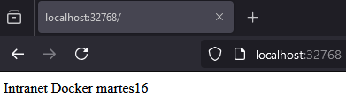

# Laboratorios Curso Docker

### Nombre: Martín

### Apellidos: Gil Blanco

---

- [Laboratorio 1: Comandos básicos](#laboratorio-1-comandos-básicos)
- [Laboratorio 2: Publicar una imagen en Docker Hub](#laboratorio-2-publicar-una-imagen-en-docker-hub)
- [Laboratorio 3: Configuración de Docker Compose para MySQL y WordPress](#laboratorio-3-explique-la-siguiente-configuración-de-este-archivo-docker-compose-para-desplegar-un-entorno-de-mysql-y-wordpress)
- [Laboratorio 4: Comandos de Docker Compose](#laboratorio-4-explique-los-siguientes-comandos-de-docker-compose)
- [Laboratorio 5: Explicación de estructuras de Docker Compose](#laboratorio-5-explique-las-siguientes-estructuras-de-los-campos-de-docker-compose-que-faltan-por-comentar)

---

### **Laboratorio 1: Comandos básicos**

#### **1. Comando para parar todos los contenedores**

```bash
docker stop $(docker ps -q)
```

```bash
PS C:\Users\gilbl\OneDrive\Escritorio\Martin\Trabajo\2024-2025\Ordinario\Diseño de Interfaces\Docker> docker ps
CONTAINER ID   IMAGE     COMMAND                  CREATED         STATUS         PORTS                    NAMES
2d99af97a4c9   mariadb   "docker-entrypoint.s…"   8 seconds ago   Up 8 seconds   0.0.0.0:3307->3306/tcp   bd1

PS C:\Users\gilbl\OneDrive\Escritorio\Martin\Trabajo\2024-2025\Ordinario\Diseño de Interfaces\Docker> docker stop $(docker ps -q)
2d99af97a4c9
```

#### **2. Comando para eliminar todos los contenedores**

```bash
docker rm $(docker ps -aq)
```

```bash
PS C:\Users\gilbl\OneDrive\Escritorio\Martin\Trabajo\2024-2025\Ordinario\Diseño de Interfaces\Docker> docker ps -a
CONTAINER ID   IMAGE     COMMAND                  CREATED          STATUS                     PORTS     NAMES
2d99af97a4c9   mariadb   "docker-entrypoint.s…"   21 seconds ago   Exited (0) 7 seconds ago             bd1

PS C:\Users\gilbl\OneDrive\Escritorio\Martin\Trabajo\2024-2025\Ordinario\Diseño de Interfaces\Docker> docker rm $(docker ps -aq)
2d99af97a4c9
```

#### **3. Lanzar un contenedor llamado `web1` con la imagen `agarciaf/intranet`**

```bash
docker run -d --name web1 agarciaf/intranet
```

```bash
PS C:\Users\gilbl\OneDrive\Escritorio\Martin\Trabajo\2024-2025\Ordinario\Diseño de Interfaces\Docker> docker run -d --name web1 agarciaf/intranet
Unable to find image 'agarciaf/intranet:latest' locally
latest: Pulling from agarciaf/intranet
a3ed95caeb02: Pull complete
35d9d5d11536: Pull complete
c422cdb256a9: Pull complete
bd3dfdafe65b: Pull complete
bd3462764183: Pull complete
665c411390e3: Pull complete
8fc0c0a1c4fe: Pull complete
bc31532139f0: Pull complete
555193311939: Pull complete
50197e4977e2: Pull complete
11cf2fa9714b: Pull complete
88d7e466811c: Pull complete
6969966ecc41: Pull complete
f99014094379: Pull complete
31ec0d0094d4: Pull complete
54cfd34f58b8: Pull complete
f8c1adcda761: Pull complete
Digest: sha256:a6c66644ee7547ea2f17de07dc67f11307b469fe5c9002dfc38433bad5f269c5
Status: Downloaded newer image for agarciaf/intranet:latest
a5921babd57b236b0bb94917628580fc2cea9d793d4c3bd18b896a5ce9778387

PS C:\Users\gilbl\OneDrive\Escritorio\Martin\Trabajo\2024-2025\Ordinario\Diseño de Interfaces\Docker> docker ps -a
CONTAINER ID   IMAGE               COMMAND            CREATED         STATUS                       PORTS     NAMES
a5921babd57b   agarciaf/intranet   "supervisord -n"   9 seconds ago   Exited (139) 7 seconds ago             web1
```

#### **4. Lanzar un contenedor llamado `bd1` con la imagen `mariadb`**

```bash
docker container run `
 --name bd1 `
 -dp 3307:3306 `
 -e MARIADB_USER=example-user `
 -e MARIADB_PASSWORD=user-password `
 -e MARIADB_ROOT_PASSWORD=root-secret-password `
 -e MARIADB_DATABASE=world-db `
 mariadb
```

```bash
PS C:\Users\gilbl\OneDrive\Escritorio\Martin\Trabajo\2024-2025\Ordinario\Diseño de Interfaces\Docker> docker container run `
>>  --name bd1 `
>>  -dp 3307:3306 `
>>  -e MARIADB_USER=example-user `
>>  -e MARIADB_PASSWORD=user-password `
>>  -e MARIADB_ROOT_PASSWORD=root-secret-password `
>>  -e MARIADB_DATABASE=world-db `
>>  mariadb
e653ed202377bb56c7b3d3982db452dbe7e9895dd67512dc43ce764d49565c80

PS C:\Users\gilbl\OneDrive\Escritorio\Martin\Trabajo\2024-2025\Ordinario\Diseño de Interfaces\Docker> docker ps -a
CONTAINER ID   IMAGE               COMMAND                  CREATED          STATUS                        PORTS                    NAMES
e653ed202377   mariadb             "docker-entrypoint.s…"   6 seconds ago    Up 5 seconds                  0.0.0.0:3307->3306/tcp   bd1
a5921babd57b   agarciaf/intranet   "supervisord -n"         54 seconds ago   Exited (139) 52 seconds ago                            web1
```

#### **5. Lanzar un contenedor llamado `bd2` con la imagen `postgres`**

```bash
docker container run `
 -d `
 --name postgres-db `
 -e POSTGRES_PASSWORD=123456 `
 -v postgres-db:/var/lib/postgresql/data `
 postgres:15.1
```

```bash
PS C:\Users\gilbl\OneDrive\Escritorio\Martin\Trabajo\2024-2025\Ordinario\Diseño de Interfaces\Docker> docker container run `
>>  -d `
>>  --name postgres-db `
>>  -e POSTGRES_PASSWORD=123456 `
>>  -v postgres-db:/var/lib/postgresql/data `
>> postgres
0b01ab2aa2a7effcc5c9f34253a4429960a97d18baf9f867445b3f45f42e6958

PS C:\Users\gilbl\OneDrive\Escritorio\Martin\Trabajo\2024-2025\Ordinario\Diseño de Interfaces\Docker> docker ps -a
CONTAINER ID   IMAGE               COMMAND                  CREATED          STATUS                       PORTS                    NAMES
0b01ab2aa2a7   postgres            "docker-entrypoint.s…"   11 seconds ago   Up 10 seconds                5432/tcp                 postgres-db
e653ed202377   mariadb             "docker-entrypoint.s…"   2 minutes ago    Up 2 minutes                 0.0.0.0:3307->3306/tcp   bd1
a5921babd57b   agarciaf/intranet   "supervisord -n"         2 minutes ago    Exited (139) 2 minutes ago                            web1
```

#### **6. Lanzar un contenedor llamado `web2` que exponga el puerto en nuestra máquina `81` basado en la imagen `nginx`, y que se reinicie siempre**

```bash
docker run -d --name web2 -p 81:80 --restart always nginx
```

```bash
PS C:\Users\gilbl\OneDrive\Escritorio\Martin\Trabajo\2024-2025\Ordinario\Diseño de Interfaces\Docker> docker run -d --name web2 -p 81:80 --restart always nginx
e5f23df51d9aed5c7c0da913247150759766db5c12f09d4b19754dbf4f743ca7

PS C:\Users\gilbl\OneDrive\Escritorio\Martin\Trabajo\2024-2025\Ordinario\Diseño de Interfaces\Docker> docker ps -a
CONTAINER ID   IMAGE               COMMAND                  CREATED              STATUS                       PORTS                    NAMES
e5f23df51d9a   nginx               "/docker-entrypoint.…"   59 seconds ago       Up 58 seconds                0.0.0.0:81->80/tcp       web2
0b01ab2aa2a7   postgres            "docker-entrypoint.s…"   About a minute ago   Up About a minute            5432/tcp                 postgres-db
e653ed202377   mariadb             "docker-entrypoint.s…"   3 minutes ago        Up 3 minutes                 0.0.0.0:3307->3306/tcp   bd1
a5921babd57b   agarciaf/intranet   "supervisord -n"         4 minutes ago        Exited (139) 4 minutes ago                            web1
```

#### **7. ¿Qué IP tienen los contenedores `web1` y `web2`?**

Con el siguiente comando podemos ver el estado y buscar el apartado `"IPAddress": "X.X.X.X"`, donde están las IPs como `"172.17.0.2"`.

```bash
docker inspect id_contenedor/nombre_contenedor
```

```bash
PS C:\Users\gilbl\OneDrive\Escritorio\Martin\Trabajo\2024-2025\Ordinario\Diseño de Interfaces\Docker> docker inspect web2
"IPAddress": "172.17.0.4",

PS C:\Users\gilbl\OneDrive\Escritorio\Martin\Trabajo\2024-2025\Ordinario\Diseño de Interfaces\Docker> docker inspect web1
"IPAddress": "172.17.0.5",
```

#### **8. Comando para ver las estadísticas del contenedor `web1` y `web2`**

```bash
docker stats
```

```docker
CONTAINER ID   NAME      CPU %     MEM USAGE / LIMIT     MEM %     NET I/O     BLOCK I/O   PIDS
e5f23df51d9a   web2      0.00%     10.01MiB / 7.441GiB   0.13%     746B / 0B   0B / 0B     13
```

---

### **Laboratorio 2: Publicar una imagen en Docker Hub**

En este laboratorio seguiremos este procedimiento para lanzan un contenedor y convertirlo a imagen, tras la conversión a imagen subiremos dicha imagen a nuestro Docker hub, en el cual tendremos que tener creada una cuenta para poder realizar dicho laboratorio.

[docker](https://hub.docker.com/)

Partimos de la imagen httpd que tiene como document-root el directorio: `/usr/local/apache2/htdocs`


#### **1. Lanzamos contenedor intranet**

```bash
docker run -dtiP --name intranet httpd
```

```bash
PS C:\Users\Carballeira\Documents\Docker> git pull origin main
remote: Enumerating objects: 25, done.
remote: Counting objects: 100% (25/25), done.
remote: Compressing objects: 100% (8/8), done.
remote: Total 17 (delta 12), reused 13 (delta 8), pack-reused 0 (from 0)
Unpacking objects: 100% (17/17), 135.25 KiB | 547.00 KiB/s, done.
PS C:\Users\Carballeira\Documents\Docker> docker pull httpd
Using default tag: latest
latest: Pulling from library/httpd
7f5fb3689eae: Download complete
4f4fb700ef54: Already exists
abbcd5aab366: Download complete
af302e5c37e9: Download complete
04e5e6c6b497: Download complete
c14eb63a15a0: Download complete
Digest: sha256:437b9f7d469dd606fa6d2a5f9a3be55fe3af7e0c66e0329da8c14b291ae0d31c
Status: Downloaded newer image for httpd:latest
docker.io/library/httpd:latest

PS C:\Users\Carballeira\Documents\Docker> docker run -dtiP --name intranet httpd
d54b746221e158c6ecc50b9343c50a46498b7470494e910dd34fb0a65dc58ab1

PS C:\Users\Carballeira\Documents\Docker> docker ps 
CONTAINER ID   IMAGE     COMMAND              CREATED         STATUS         PORTS                   NAMES
d54b746221e1   httpd     "httpd-foreground"   7 seconds ago   Up 6 seconds   0.0.0.0:32768->80/tcp   intranet
```

#### **2. Entramos en el contenedor y creamos un index.html**

```bash
docker exec -ti intranet /bin/bash
cd /usr/local/apache2/htdocs
mv index.html index.html-copia
echo "Intranet Docker martes16" > index.html
exit
```

```bash
PS C:\Users\Carballeira\Documents\Docker> docker exec -it intranet /bin/bash

root@d54b746221e1:/usr/local/apache2# cd /usr/local/apache2/htdocs/

root@d54b746221e1:/usr/local/apache2/htdocs# mv index.html index.html-copia 

root@d54b746221e1:/usr/local/apache2/htdocs# echo "Intranet Docker martes16" > index.html

root@d54b746221e1:/usr/local/apache2/htdocs# cat index.html
Intranet Docker martes16

root@d54b746221e1:/usr/local/apache2/htdocs# exit

exit
```

#### **3. Nos salimos del contenedor y visualizamos los puertos que tenemos nateados**

```bash
docker ps -l
```

```bash
PS C:\Users\Carballeira\Documents\Docker> docker ps -l
CONTAINER ID   IMAGE     COMMAND              CREATED         STATUS         PORTS                   NAMES
d54b746221e1   httpd     "httpd-foreground"   4 minutes ago   Up 4 minutes   0.0.0.0:32768->80/tcp   intranet
```



#### **4. Salvamos el contenedor a imagen**

```bash
docker commit -m "Intranet-Laboratorio" intranet intranet
#You can use docker history command:
docker history <image hash>
docker images |grep intranet
```

```bash
PS C:\Users\Carballeira\Documents\Docker> docker images
REPOSITORY   TAG       IMAGE ID       CREATED      SIZE
httpd        latest    437b9f7d469d   5 days ago   221MB

PS C:\Users\Carballeira\Documents\Docker> docker ps         
CONTAINER ID   IMAGE     COMMAND              CREATED          STATUS          PORTS                   NAMES
d54b746221e1   httpd     "httpd-foreground"   19 minutes ago   Up 19 minutes   0.0.0.0:32768->80/tcp   intranet

PS C:\Users\Carballeira\Documents\Docker> docker commit -m "Intranet-Laboratorio" intranet intranet-imagen
sha256:632ea7b915adcc4a0f010b4f1dc7fa5be0e35a78cd3e2f0516d54bdc5bab96c8

PS C:\Users\Carballeira\Documents\Docker> docker images
REPOSITORY        TAG       IMAGE ID       CREATED         SIZE
intranet-imagen   latest    632ea7b915ad   3 seconds ago   221MB
httpd             latest    437b9f7d469d   5 days ago      221MB
PS C:\Users\Carballeira\Documents\Docker> docker history 632ea7b915adcc4a0f010b4f1dc7fa5be0e35a78cd3e2f0516d54bdc5bab96c8
IMAGE          CREATED          CREATED BY                                      SIZE      COMMENT
632ea7b915ad   27 seconds ago   httpd-foreground                                45.1kB    Intranet-Laboratorio
437b9f7d469d   5 days ago       CMD ["httpd-foreground"]                        0B        buildkit.dockerfile.v0
<missing>      5 days ago       EXPOSE map[80/tcp:{}]                           0B        buildkit.dockerfile.v0
<missing>      5 days ago       COPY httpd-foreground /usr/local/bin/ # buil…   20.5kB    buildkit.dockerfile.v0
<missing>      5 days ago       STOPSIGNAL SIGWINCH                             0B        buildkit.dockerfile.v0
<missing>      5 days ago       RUN /bin/sh -c set -eux;   savedAptMark="$(a…   64.5MB    buildkit.dockerfile.v0
<missing>      5 days ago       ENV HTTPD_PATCHES=                              0B        buildkit.dockerfile.v0
<missing>      5 days ago       ENV HTTPD_SHA256=88fc236ab99b2864b248de7d49a…   0B        buildkit.dockerfile.v0
<missing>      5 days ago       ENV HTTPD_VERSION=2.4.63                        0B        buildkit.dockerfile.v0
<missing>      5 days ago       RUN /bin/sh -c set -eux;  apt-get update;  a…   12.3MB    buildkit.dockerfile.v0
<missing>      5 days ago       WORKDIR /usr/local/apache2                      4.1kB     buildkit.dockerfile.v0
<missing>      5 days ago       RUN /bin/sh -c mkdir -p "$HTTPD_PREFIX"  && …   16.4kB    buildkit.dockerfile.v0
<missing>      5 days ago       ENV PATH=/usr/local/apache2/bin:/usr/local/s…   0B        buildkit.dockerfile.v0
<missing>      5 days ago       ENV HTTPD_PREFIX=/usr/local/apache2             0B        buildkit.dockerfile.v0
<missing>      2 weeks ago      # debian.sh --arch 'amd64' out/ 'bookworm' '…   85.2MB    debuerreotype 0.15
```

#### **5. Eliminamos el contenedor base**

```bash
docker rm -f intranet
```

```bash
PS C:\Users\Carballeira\Documents\Docker> docker ps
CONTAINER ID   IMAGE     COMMAND              CREATED          STATUS          PORTS                   NAMES
d54b746221e1   httpd     "httpd-foreground"   22 minutes ago   Up 22 minutes   0.0.0.0:32768->80/tcp   intranet

PS C:\Users\Carballeira\Documents\Docker> docker rm -f intranet
intranet

PS C:\Users\Carballeira\Documents\Docker> docker ps -a
CONTAINER ID   IMAGE     COMMAND   CREATED   STATUS    PORTS     NAMES
```

#### **6. Lanzamos un nuevo contenedor basado en la imagen creada del contenedor anteriormente:**

```bash
docker run -ditP --name intranet1 intranet
docker ps -l
http://192.168.33.10:PUERTO
docker system  df -v
docker images |grep intranet
```

```bash
PS C:\Users\Carballeira\Documents\Docker> docker run -ditP --name intranet1 intranet-imagen
61fd98e7a03ea6a4e643a58f193b3122c39cb22fd12d033738be3718113c6c5e

PS C:\Users\Carballeira\Documents\Docker> docker ps
CONTAINER ID   IMAGE             COMMAND              CREATED         STATUS         PORTS                   NAMES
61fd98e7a03e   intranet-imagen   "httpd-foreground"   3 seconds ago   Up 2 seconds   0.0.0.0:32769->80/tcp   intranet1

PS C:\Users\Carballeira\Documents\Docker> docker system df -v
Images space usage:

REPOSITORY        TAG       IMAGE ID       CREATED         SIZE      SHARED SIZE   UNIQUE SIZE   CONTAINERS
intranet-imagen   latest    632ea7b915ad   5 minutes ago   221MB     162.1MB       58.55MB       1
httpd             latest    437b9f7d469d   5 days ago      221MB     162.1MB       58.48MB       0

Containers space usage:

CONTAINER ID   IMAGE             COMMAND              LOCAL VOLUMES   SIZE      CREATED          STATUS          NAMES
61fd98e7a03e   intranet-imagen   "httpd-foreground"   0               36.9kB    13 seconds ago   Up 12 seconds   intranet1

Local Volumes space usage:

VOLUME NAME   LINKS     SIZE

Build cache usage: 721.7MB

CACHE ID       CACHE TYPE     SIZE      CREATED       LAST USED     USAGE     SHARED
vzent0f9ghmf   regular        8.22kB    10 days ago   10 days ago   1         false
v7wevp0fpm67   regular        45.3kB    10 days ago   10 days ago   1         false
i9gv0l1ikbuy   source.local   8.19kB    10 days ago   10 days ago   1         false
8o2obnwv8p8i   regular        181MB     10 days ago   10 days ago   1         false
aysd1q2iyx0z   regular        540MB     10 days ago   10 days ago   1         false
jgnd5idsmlws   regular        28.9kB    10 days ago   10 days ago   1         false
g223tx3amsri   source.local   8.19kB    10 days ago   10 days ago   1         false
ieno5xt9uuj8   source.local   4.1kB     10 days ago   10 days ago   1         false
```

#### **7. Publicar una imagen en Docker Hub:**

```bash
PS C:\Users\Carballeira\Documents\Docker> docker images
REPOSITORY        TAG       IMAGE ID       CREATED          SIZE
intranet-imagen   latest    632ea7b915ad   11 minutes ago   221MB
httpd             latest    437b9f7d469d   5 days ago       221MB

PS C:\Users\Carballeira\Documents\Docker> docker tag intranet-imagen martin2745/intranet-imagen:v1

PS C:\Users\Carballeira\Documents\Docker> docker images
REPOSITORY                   TAG       IMAGE ID       CREATED          SIZE
martin2745/intranet-imagen   v1        632ea7b915ad   12 minutes ago   221MB
intranet-imagen              latest    632ea7b915ad   12 minutes ago   221MB
httpd                        latest    437b9f7d469d   5 days ago       221MB

PS C:\Users\Carballeira\Documents\Docker> docker login
Authenticating with existing credentials...
Login Succeeded

PS C:\Users\Carballeira\Documents\Docker> docker push martin2745/intranet-imagen:v1
The push refers to repository [docker.io/martin2745/intranet-imagen]
abbcd5aab366: Mounted from library/httpd
04e5e6c6b497: Mounted from library/httpd
7f5fb3689eae: Mounted from library/httpd
c14eb63a15a0: Mounted from library/httpd
4f4fb700ef54: Mounted from library/httpd
a15f17585a15: Pushed
af302e5c37e9: Mounted from library/httpd
v1: digest: sha256:632ea7b915adcc4a0f010b4f1dc7fa5be0e35a78cd3e2f0516d54bdc5bab96c8 size: 1824

PS C:\Users\Carballeira\Documents\Docker> docker search martin2745/intranet-imagen 
NAME                             DESCRIPTION   STARS     OFFICIAL
martin2745/intranet-imagen                     0

PS C:\Users\Carballeira\Documents\Docker> docker logout
Removing login credentials for https://index.docker.io/v1/
```


---

### **Laboratorio 3: Explique la siguiente configuración de este archivo docker compose, para desplegar un entorno de Mysql y WordPress**

```yml
version: '3.8'  # Versión de Docker Compose

services:
  db:  # Servicio para la base de datos MySQL
    image: mysql:5.7  # Usa la imagen oficial de MySQL versión 5.7
    container_name: mysql_db  # Nombre del contenedor
    restart: always  # Reinicia el contenedor automáticamente si falla
    environment:  # Variables de entorno para configurar MySQL
      MYSQL_ROOT_PASSWORD: root_password  # Contraseña del usuario root
      MYSQL_DATABASE: wordpress  # Nombre de la base de datos
      MYSQL_USER: wp_user  # Usuario de la base de datos
      MYSQL_PASSWORD: wp_password  # Contraseña del usuario de la base de datos
    volumes:
      - db_data:/var/lib/mysql  # Persistencia de los datos de la base de datos
    networks:
      - wp_network  # Conecta el servicio a la red definida

  wordpress:  # Servicio para la aplicación WordPress
    image: wordpress:5.6.2-php7.3  # Usa la imagen oficial de WordPress con PHP 7.3
    container_name: wordpress_app  # Nombre del contenedor
    depends_on:
      - db  # Asegura que el servicio "db" esté iniciado antes de este servicio
    ports:
      - "8080:80"  # Mapea el puerto 8080 del host al puerto 80 del contenedor
    restart: always  # Reinicia el contenedor automáticamente si falla
    environment:  # Variables de entorno para conectar WordPress con MySQL
      WORDPRESS_DB_HOST: db:3306  # Nombre del servicio MySQL y su puerto
      WORDPRESS_DB_USER: wp_user  # Usuario de la base de datos
      WORDPRESS_DB_PASSWORD: wp_password  # Contraseña del usuario
      WORDPRESS_DB_NAME: wordpress  # Nombre de la base de datos
    volumes:
      - wp_data:/var/www/html  # Persistencia de los archivos de WordPress
    networks:
      - wp_network  # Conecta el servicio a la red definida

volumes:  # Definición de volúmenes persistentes
  db_data:  # Almacena datos de MySQL
  wp_data:  # Almacena archivos de WordPress

networks:  # Definición de redes personalizadas
  wp_network:  # Red para la comunicación entre WordPress y MySQL
```

```bash
PS C:\Users\Carballeira\Documents\prueba> docker compose up -d
time="2025-01-29T09:55:10+01:00" level=warning msg="C:\\Users\\Carballeira\\Documents\\prueba\\docker-compose.yml: the attribute `version` is obsolete, it will be ignored, please remove it to avoid potential confusion"
[+] Running 34/2
 ✔ db Pulled                                                                                                                                                                                                                    14.3s 
 ✔ wordpress Pulled                                                                                                                                                                                                             14.2s 
[+] Running 5/5
 ✔ Network prueba_wp_network  Created                                                                                                                                                                                            0.0s 
 ✔ Volume "prueba_wp_data"    Created                                                                                                                                                                                            0.0s 
 ✔ Volume "prueba_db_data"    Created                                                                                                                                                                                            0.0s 
 ✔ Container mysql_db         Started                                                                                                                                                                                            1.5s 
 ✔ Container wordpress_app    Started                                                                                                                                                                                            0.7s 

PS C:\Users\Carballeira\Documents\prueba> docker ps 
CONTAINER ID   IMAGE                    COMMAND                  CREATED         STATUS         PORTS                  NAMES
1a261dcf8809   wordpress:5.6.2-php7.3   "docker-entrypoint.s…"   8 seconds ago   Up 7 seconds   0.0.0.0:8080->80/tcp   wordpress_app
19ac6d85f926   mysql:5.7                "docker-entrypoint.s…"   9 seconds ago   Up 7 seconds   3306/tcp, 33060/tcp    mysql_db

PS C:\Users\Carballeira\Documents\prueba> docker volume ls
DRIVER    VOLUME NAME
local     prueba_db_data
local     prueba_wp_data
```


---

### **Laboratorio 4: Explique los siguientes comandos de docker compose**


| Comando                          | Descripción |
|----------------------------------|-------------|
| `docker compose build`           | Construye las imágenes de los servicios definidos en `docker-compose.yml`. |
| `docker compose up --build`      | Levanta los contenedores y vuelve a construir las imágenes antes de iniciarlos. |
| `docker compose logs`            | Muestra los registros (`logs`) de los contenedores en ejecución. |
| `docker compose logs -f`         | Muestra los registros en tiempo real (`follow mode`). |
| `docker compose exec <servicio>` | Ejecuta un comando dentro de un contenedor en ejecución (como `docker exec`). |
| `docker compose run <servicio>`  | Crea y ejecuta un nuevo contenedor del servicio especificado, sin iniciar los definidos en `docker-compose.yml`. |
| `docker compose scale <servicio>=N` | Escala un servicio a `N` instancias (solo en versiones antiguas de Compose, ahora se usa `replicas` en `deploy`). |
| `docker compose rm`              | Elimina los contenedores detenidos de la composición. |
| `docker compose kill`            | Detiene inmediatamente los contenedores de la composición sin apagado limpio. |
| `docker compose top`             | Muestra los procesos en ejecución dentro de los contenedores gestionados por `docker-compose`. |
| `docker compose pull`            | Descarga las imágenes definidas en el `docker-compose.yml` desde Docker Hub o un registro privado. |
| `docker compose push`            | Sube las imágenes de los servicios al registro de contenedores configurado (como Docker Hub). |

---

### **Laboratorio 5: Explique las siguientes estructuras de los campos de docker compose, que faltan por comentar**

```yml
version: '3.8'  # Especifica la versión de Docker Compose

services:  # Define los servicios que se ejecutarán en contenedores
  db:  # Define el servicio de la base de datos (MySQL)
    image: mysql:5.7  # Usa la imagen oficial de MySQL versión 5.7
    container_name: mysql_db  # Asigna un nombre al contenedor de MySQL
    restart: always  # Reinicia el contenedor automáticamente si falla
    environment:  # Variables de entorno para configurar la base de datos
      MYSQL_ROOT_PASSWORD: root_password  # Contraseña del usuario root de MySQL
      MYSQL_DATABASE: example_db  # Nombre de la base de datos que se creará automáticamente
      MYSQL_USER: example_user  # Usuario que tendrá acceso a la base de datos
      MYSQL_PASSWORD: example_password  # Contraseña del usuario de la base de datos
    volumes:  # Define un volumen para almacenar los datos de MySQL de forma persistente
      - db_data:/var/lib/mysql  # Asocia el volumen 'db_data' con la carpeta de datos de MySQL
    networks:  # Conecta este servicio a una red personalizada
      - example_network  # Nombre de la red compartida con otros servicios

  app:  # Define el servicio de la aplicación web (WordPress)
    image: wordpress:5.8  # Usa la imagen oficial de WordPress versión 5.8
    container_name: wordpress_app  # Asigna un nombre al contenedor de WordPress
    depends_on:  # Indica que este servicio depende del servicio 'db' (MySQL), asegurando que se inicie primero
      - db  # Se inicia el contenedor 'db' antes de 'app'
    ports:  # Mapea los puertos del contenedor a los del host
      - "8080:80"  # Expone el puerto 80 del contenedor en el puerto 8080 del host
    restart: always  # Reinicia el contenedor automáticamente si falla
    environment:  # Variables de entorno para configurar WordPress
      WORDPRESS_DB_HOST: db:3306  # Dirección y puerto de la base de datos MySQL
      WORDPRESS_DB_USER: example_user  # Usuario de la base de datos
      WORDPRESS_DB_PASSWORD: example_password  # Contraseña del usuario de la base de datos
      WORDPRESS_DB_NAME: example_db  # Nombre de la base de datos que WordPress utilizará
    volumes:  # Define un volumen para almacenar archivos de WordPress
      - app_data:/var/www/html  # Asocia el volumen 'app_data' con la carpeta de WordPress
    networks:  # Conecta este servicio a la red personalizada
      - example_network  # Nombre de la red compartida con otros servicios

volumes:  # Define volúmenes para almacenar datos de forma persistente
  db_data:  # Volumen para los datos de MySQL
  app_data:  # Volumen para los archivos de WordPress

networks:  # Define redes personalizadas para la comunicación entre los servicios
  example_network:  # Red donde 'db' y 'app' pueden comunicarse sin interferencias externas
```

```bash
PS C:\Users\Carballeira\Documents\prueba> docker compose up -d
time="2025-01-29T09:58:12+01:00" level=warning msg="C:\\Users\\Carballeira\\Documents\\prueba\\docker-compose.yml: the attribute `version` is obsolete, it will be ignored, please remove it to avoid potential confusion"
[+] Running 34/2
 ✔ app Pulled                                                                                                                                                                                                                   25.2s 
 ✔ db Pulled                                                                                                                                                                                                                    20.9s 
[+] Running 5/5
 ✔ Network prueba_example_network  Created                                                                                                                                                                                       0.0s 
 ✔ Volume "prueba_db_data"         Created                                                                                                                                                                                       0.0s 
 ✔ Volume "prueba_app_data"        Created                                                                                                                                                                                       0.0s 
 ✔ Container mysql_db              Started                                                                                                                                                                                       2.3s 
 ✔ Container wordpress_app         Started                                                                                                                                                                                       0.7s 
 
PS C:\Users\Carballeira\Documents\prueba> docker ps           
CONTAINER ID   IMAGE           COMMAND                  CREATED          STATUS          PORTS                  NAMES
4204c22c6493   wordpress:5.8   "docker-entrypoint.s…"   38 seconds ago   Up 37 seconds   0.0.0.0:8080->80/tcp   wordpress_app
23268fa89efc   mysql:5.7       "docker-entrypoint.s…"   40 seconds ago   Up 37 seconds   3306/tcp, 33060/tcp    mysql_db

PS C:\Users\Carballeira\Documents\prueba> docker volume ls    
DRIVER    VOLUME NAME
local     prueba_app_data
local     prueba_db_data
```